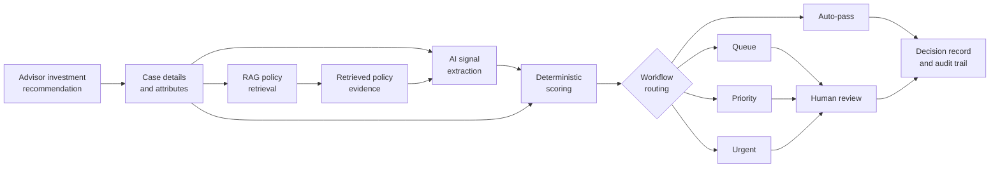

# AI Compliance Review Copilot
A human-in-the-loop, RAG-enabled decision-support workflow for investment compliance review.

## 1. Overview
This project implements and evaluates a human-in-the-loop, RAG-enabled workflow for reviewing simulated investment recommendations. It combines policy retrieval, AI-assisted signal extraction, deterministic scoring and routing, a reviewer-dashboard prototype, and retrieval diagnostics to evaluate where automation may be appropriate and where human review remains necessary.

**Start here:** [Executive Memo](docs/executive_memo.md) — a concise product summary of the problem, solution, results, and recommendation.

## 2. Problem
Wealth management firms must review advisor investment recommendations for regulatory and suitability risks, but human-only review is difficult to scale. Existing rule-based systems can generate large volumes of low-quality alerts while struggling with complex cases and unstructured client-advisor information, contributing to reviewer backlogs and inconsistent decisions.

The product challenge is not simply to maximize model accuracy, but to determine the lowest safe workflow level for each case while minimizing both missed compliance risks and unnecessary reviewer escalation.

## 3. Product Concept and Decision Flow


## 4. Implemented Scope
### 4.1 AI and decision pipeline
- Synthetic case generation and ground-truth labeling
- RAG-based policy retrieval and structured AI signal extraction
- Deterministic scoring logic using case attributes, retrieved evidence, and AI-extracted signals
- Risk-based workflow routing
- Retrieval, AI-decision, and reviewer-action logging for decision traceability

### 4.2 Evaluation
- North Star Metric, compliance, and workflow-routing evaluation
- Safety and reviewer-burden analysis
- Retrieval and calibration diagnostics
- Overconfidence, trust-evolution, and failure-mode analysis

### 4.3 Reviewer experience
- Risk-prioritized review queues
- Structured case, assessment, and policy-evidence summaries
- Approval, rejection, escalation, and reviewer-comment controls
- Decision history and audit trail

## 5. Primary Evaluation Question
**Can the system correctly resolve investment compliance cases at the lowest safe workflow level while limiting regulatory risk and unnecessary reviewer escalation?**

## 6. Evaluation Scorecard
### Product Safety and Workflow Outcomes:
|Metric|Result|Product implication|
|:-----|:-----|:---------------------|
|North Star Metric*|79.6%|20.4% of cases were either under-routed or sent to a more burdensome workflow than necessary.|
|Compliance accuracy|99.7%|Two of 780 cases received an incorrect compliance classification.|
|Compliance false-negative rate [%]|0%|No non-compliant cases were incorrectly classified as compliant.|
|Urgent case recall|35.4%|Thirty-one of 48 urgent cases were routed as priority, delaying the intended urgency of review.|
|Auto-pass over-escalation|33.5%|Ninety-one of 272 eligible auto-pass cases were unnecessarily sent to review workflows.|
|Escalation precision|84.7%|Most system-escalated cases corresponded to cases that required compliance review.|

*The North Star Metric is the percentage of cases correctly resolved at the lowest safe workflow level. In this framework, it is equivalent to workflow-routing accuracy.

### Trust and Confidence:
|Metric|Result|Product implication|
|:-----|:-----|:------------------|
|Overconfidence Rate (@threshold=0.5) [%]|0.3%|Only two in 744 cases were incorrectly classified with confidence greater than the threshold; however, because there were so few incorrect classifications, this result should not be interpreted as meaning the calibration is broadly reliable.|
|Trust proxy change|0.700 → 0.894|The simulated trust proxy rose over the evaluation sequence, but it is not validated against observed reviewer behaviour.|

<p align="center">
  <br>
  <i>Simulated trust-proxy evolution across the evaluation sequence. This is an analytical simulation, not observed user behaviour.</i>
</p>

### Retrieval and System Diagnostics:
|Metric|Result|Product implication|
|:-----|:-----|:------------------|
|Selected-policy precision*|32.3%|Retrieval was broad and frequently included policies not labelled relevant to the case.|
|Selected-policy recall*|54.9%|The retriever returned slightly more than half of all policies labelled relevant across the evaluated cases.|
|Primary policy retrieval rate [%]|66.0%|The most important relevant policy was absent from the retrieved context in roughly one-third of applicable cases.|
|Any relevant policy retrieval rate [%]|91.2%|Most cases received at least some relevant policy context despite weaker precision and primary-policy coverage.|
|Most frequent failure mode|Auto-pass over-routing|Ninety-one 'auto-pass' cases were unnecessarily escalated to 'queue' (84 cases) or 'priority' (7 cases), accounting for 57.2% of all failure cases.|

*Note: Average precision and recall over filtered, deduplicated policies actually included in the LLM context, up to five.

[View full evaluation notebook](notebooks/AI_compliance_copilot_evaluation.ipynb)

Follow-up [retrieval benchmarking](notebooks/retrieval_benchmarks_analysis.ipynb) found that query and reranking changes could substantially improve retrieval recall and reduce noisy context, but did not materially improve downstream workflow-routing performance in the tested cases. This suggests that retrieval quality is a contributor but not the only bottleneck; routing thresholds, risk scoring, confidence scoring, and alignment between ground-truth workflow labels and prediction logic likely require further investigation.

## 7. Key Findings
The following findings are based on the 780-case held-out evaluation set:
- Compliance classification was strong, but workflow routing remained the primary performance constraint. The system achieved 99.7% compliance accuracy, while the North Star Metric reached 79.6%, showing that most remaining errors involved selecting the appropriate review route rather than determining whether a case was compliant.
- Routing behaviour was generally conservative, creating reviewer burden rather than widespread unsafe automation. Auto-pass over-routing was the most common failure mode: 91 of 272 cases eligible for auto-pass were unnecessarily sent to review workflows. Overall, over-routing accounted for most identified routing failures.
- Urgent-case prioritization requires improvement. 31 of 48 cases expected to receive urgent review were instead routed as priority. Although these cases would still reach a human reviewer, the reduced urgency could delay attention to the highest-risk cases.
- Retrieval usually returned some relevant evidence, but often failed to identify the most important policy cleanly. At least one relevant policy was retrieved for 91.2% of cases, but primary-policy retrieval reached only 66.0% and the average precision of selected context policies (up to 5) was 32.3%. This indicates broad retrieval with substantial irrelevant context and inconsistent coverage of the strongest supporting policy.
- Improving a subsystem metric such as retrieval recall does not necessarily improve the product-level North Star Metric. For this workflow, end-to-end routing quality remained the primary constraint.
- Confidence and trust results should be treated as preliminary. Only two high-confidence compliance errors occurred, providing too little error data to establish robust calibration. The simulated trust proxy increased from 0.700 to 0.894, but it represents an analytical model rather than observed reviewer behaviour.
- The held-out evaluation broadly reproduced the development-set pattern: compliance classification remained strong and workflow-routing accuracy remained near 80%, while urgent prioritization and unnecessary reviewer escalation remained the primary weaknesses.

## 8. Product Recommendation
The current prototype is best positioned as a human decision-support system rather than an autonomous compliance-review system.

The held-out evaluation set results support continued use of the pipeline to organize cases, surface policy evidence, and assist reviewer triage. However, unattended deployment is not yet recommended because urgent-case recall and primary-policy retrieval remain below the level required for reliable risk-based automation.

Before broader deployment:

- Improve urgent-case routing so that high-risk cases are consistently surfaced at the required review priority.
- Increase primary-policy retrieval and reduce repetitive or irrelevant context.
- Reduce unnecessary auto-pass over-routing without weakening false-negative or urgent-case safeguards.
- Validate any materially revised pipeline on a new, untouched held-out dataset.
- Validate the prototype with compliance-domain users, including reviewer workflow fit, trust calibration, explanation usefulness, and feedback loops.

A limited future auto-pass capability may be appropriate for narrowly defined, low-risk cases, but only after held-out evaluation confirms that safety metrics remain stable.

## 9. Reviewer Workflow Prototype
<p align="center">
  <br>
  <i>Reviewer dashboard prototype showing prioritized case queues, structured assessment evidence, policy references, and reviewer decision controls.</i>
</p>

## 10. Dataset and Assumptions
|Component|Description|
|:--------|:----------|
|Cases|1,000 synthetic advisor investment recommendations spanning multiple compliance scenarios, client archetypes, and advisor profiles. A 220-case development set was used to diagnose and tune pipeline behaviour; 780 held-out cases were reserved for final evaluation. The AI evaluation notebook analyzes enriched results stored in `compliance_audit.db`, which is generated by `enrich_dataset.py` from runtime CSV inputs. A curated copy of the 220-case development dataset is committed under `data/evaluation/` so the retrieval benchmark notebook can run when regenerated `data/runtime/` files are absent.|
|Policy corpus|Ten synthetic internal-policy documents, including two intentionally irrelevant/noise documents, informed by themes in publicly accessible [HighPoint Advisor Group](https://highpointplanningpartners.com/wp-content/uploads/2024/03/Compliance-Manual-11-2022.pdf) and [AE Wealth Management](https://aewealthmanagement.com/advisor-login/wp-content/uploads/sites/7/2022/09/Compliance-Policy-Manual_AEWM_Jan-10-2023_FINAL.pdf) compliance manuals and broader Canadian and U.S. wealth-management compliance concepts. The corpus is simplified for evaluation and does not reproduce either firm’s policies.|
|Ground truth|Expected compliance labels, relevant and primary policies, and workflow routes were generated using deterministic ground-truth rules separate from the prediction and routing algorithms. The labels reflect the project’s simplified domain assumptions rather than expert regulatory adjudication.|
|AI signal extraction|Gemini 3.1 Flash-Lite generates structured evidence and compliance signals using case data and retrieved policy context.|
|Decision layer|Deterministic scoring and routing logic converts AI-extracted signals, case attributes, and retrieved evidence into compliance labels, risk scores, confidence scores, and workflow routes.|
|Risk score|A deterministic severity proxy representing the potential firm-level regulatory or legal impact of failing to identify a non-compliant case.| 
|Synthetic confidence proxy|A deterministic score that increases with data completeness, evidence quality, and directional consistency, and decreases with missing or conflicting signals. It is used in workflow routing logic and not treated as the model’s internal probability of correctness.|
|Trust simulation|A synthetic trust score is updated sequentially based on compliance and routing correctness, with penalties for incorrect outcomes. It is an analytical proxy rather than a validated model of reviewer behaviour; no real-user study was conducted.|

## 11. Limitations and Next Steps
### 11.1 Limitations
- Synthetic rather than firm-provided investment recommendation data
- Synthetic and limited policy corpus
- Labels based on designed rules and assumptions rather than expert legal adjudication
- No real compliance-reviewer usability or trust study
- No production latency, security, or scalability evaluation
- Reviewer feedback not connected to recalibration
- Calibration evaluation limited by sample size

### 11.2 Next Steps
- Validate any materially revised pipeline on a new, untouched held-out dataset.
- Expand the policy corpus
- Conduct reviewer usability testing
- Add feedback-based recalibration

## 12. Technology

- **Backend and evaluation:** Python, FastAPI, SQLite, Jupyter
- **Retrieval:** Sentence Transformers (`all-MiniLM-L6-v2`)
- **AI assessment:** Gemini 3.1 Flash-Lite
- **Frontend:** React

## 13. Repository Guide
```
├── docs/          Product, requirements, metrics and risk artifacts
├── data/          Synthetic cases, ground truth labels, and policy corpus documents 
├── src/           Retrieval, scoring, decisioning, logging, data synthesis, and backend API code
├── frontend/      Reviewer dashboard prototype
├── notebooks/     Evaluation and analysis
├── artifacts/     Curated evaluation outputs and benchmark summaries
└── tests/         Automated tests
```
Quicklinks to selected artifacts:
- [Product Vision](/docs/product_vision.md)
- [Product Requirements Document](/docs/product_requirements.md)
- [Metric Hierarchy](/docs/metric_hierarchy.md)
- [Evaluation Notebook](/notebooks/AI_compliance_copilot_evaluation.ipynb)
- [Retrieval Benchmark Analysis](/notebooks/retrieval_benchmarks_analysis.ipynb)
- [Evaluation Artifacts](/artifacts/evaluation/)*
- [Retrieval Benchmark Artifacts](/artifacts/retrieval_benchmarks/)*
- [Executive Memo](/docs/executive_memo.md)

*Note: Selected evaluation outputs and benchmark summaries are included under `artifacts/` for review. Runtime logs and local experiment history are not committed; they can be regenerated by running the pipeline and notebooks.

## 14. Setup and Reproduction
These instructions were tested on Windows using PowerShell. Replace `C:\install-directory-path` with the directory where you want to install the project. Commands for other operating systems or shells may differ.

### 14.1 Clone and Set Up the Project
Run the first command from the parent directory where the repository will be installed.
```powershell
PS C:\install-directory-path> git clone https://github.com/jjchau/ai-compliance-copilot.git
PS C:\install-directory-path> Set-Location .\ai-compliance-copilot
PS C:\install-directory-path\ai-compliance-copilot> python -m venv .venv
PS C:\install-directory-path\ai-compliance-copilot> .\.venv\Scripts\Activate.ps1
PS (.venv) C:\install-directory-path\ai-compliance-copilot> python -m pip install --upgrade pip
PS (.venv) C:\install-directory-path\ai-compliance-copilot> python -m pip install -r requirements.txt
```

After activation, PowerShell will normally display `(.venv)` at the beginning of the prompt.
If PowerShell prevents the activation script from running, allow locally created scripts for the current user:
```powershell
PS C:\install-directory-path\ai-compliance-copilot> Set-ExecutionPolicy -Scope CurrentUser -ExecutionPolicy RemoteSigned
PS C:\install-directory-path\ai-compliance-copilot> .\.venv\Scripts\Activate.ps1
```

### 14.2 Configure the Gemini API
Create a Gemini API key using Google AI Studio, then expose it through an environment variable. Do not commit API keys to the repository.

Run this command in the same PowerShell session that will execute the AI pipeline:
```powershell
(.venv) PS C:\install-directory-path\ai-compliance-copilot> $env:GEMINI_API_KEY = "your-api-key"
```

Confirm that the variable is available without displaying the key itself:
```powershell
(.venv) PS C:\install-directory-path\ai-compliance-copilot> if ($env:GEMINI_API_KEY) { Write-Output "GEMINI_API_KEY is configured." }
```

The environment variable applies only to the current PowerShell session. It must be set again in a new session unless another secure configuration method is used.

### 14.3 Generate Case Data
```powershell
(.venv) PS C:\install-directory-path\ai-compliance-copilot> python .\src\data\dataset_generator.py
```

### 14.4 Embed the Policy Corpus
```powershell
(.venv) PS C:\install-directory-path\ai-compliance-copilot> python .\src\rag\ingestion.py
```

### 14.5 Run the AI Pipeline and Store Results in SQLite
Ensure that `GEMINI_API_KEY` is configured in the current PowerShell session before running this command:
```powershell
(.venv) PS C:\install-directory-path\ai-compliance-copilot> python .\enrich_dataset.py
```

### 14.6 Run the Frontend Dashboard Prototype (Optional)
The backend API and frontend development server must run in separate PowerShell windows.

#### PowerShell Window 1: Start the Backend API
```powershell
PS C:\install-directory-path> Set-Location .\ai-compliance-copilot
PS C:\install-directory-path\ai-compliance-copilot> .\.venv\Scripts\Activate.ps1
(.venv) PS C:\install-directory-path\ai-compliance-copilot> python -m uvicorn src.api.main:app --reload
```

#### PowerShell Window 2: Install and Start the Frontend
```powershell
PS C:\install-directory-path> Set-Location .\ai-compliance-copilot\frontend
PS C:\install-directory-path\ai-compliance-copilot\frontend> npm install
PS C:\install-directory-path\ai-compliance-copilot\frontend> npm run dev -- --force
```

After both servers are running, open the following address in a browser:
```text
http://localhost:5173/
```

### 14.7 Run the Evaluation Notebook
```powershell
PS C:\install-directory-path> Set-Location .\ai-compliance-copilot
PS C:\install-directory-path\ai-compliance-copilot> .\.venv\Scripts\Activate.ps1
(.venv) PS C:\install-directory-path\ai-compliance-copilot> python -m jupyter notebook .\notebooks\AI_compliance_copilot_evaluation.ipynb
```

### 14.8 Run the Retrieval Benchmark Notebook (Optional)
```powershell
PS C:\install-directory-path> Set-Location .\ai-compliance-copilot
PS C:\install-directory-path\ai-compliance-copilot> .\.venv\Scripts\Activate.ps1
(.venv) PS C:\install-directory-path\ai-compliance-copilot> python -m jupyter notebook .\notebooks\retrieval_benchmarks_analysis.ipynb
```

The retrieval benchmark notebook defaults to not making additional hosted Gemini calls. To reproduce the optional paired Gemini experiment in the notebook, set the following environment variable in the same session before running the relevant sections:

```powershell
(.venv) PS C:\install-directory-path\ai-compliance-copilot> $env:RUN_POLICY3_SENTINEL_GEMINI = "1"
```